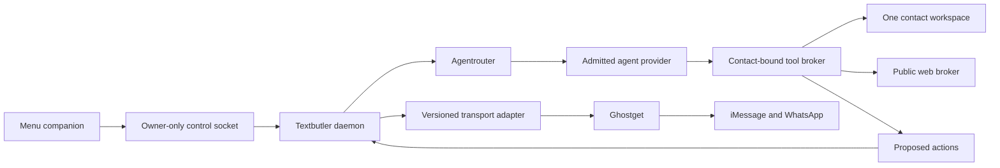

# Textbutler architecture

Textbutler is a personal message butler for macOS. An owner activates a bounded set of contacts. Each contact gets a private workspace that a coding agent can read and evolve. A separate daemon decides when to invoke that agent and controls every outward action.

The source includes the owner daemon, contact reply loop, versioned Ghostget automation protocol and macOS menu companion. Synthetic tests establish their control and recovery behavior. Live provider delivery has separate acceptance requirements below; the companion is a CLI artifact and has no signing or notarization gate.

## Ownership



Ghostget owns native permissions, message and contact acquisition, provider actions, and receipts. Textbutler does not open chat.db or automate Messages directly. Agentrouter owns provider selection, shared-account leases, cancellation, model catalogs, qualification evidence, and a bounded tool interface. Textbutler owns conversation policy and the durable send transaction. The menu companion changes owner settings through a small local protocol; it never gives a model arbitrary local commands.

The background lifecycle uses a user LaunchAgent: native messaging belongs to the signed-in Mac user, and login persistence is independent of the menu companion. Installation records the exact runtime, entrypoint, data directory and generation; removal verifies its private receipt and loaded service identity. Uninstall preserves contact data. New settings start paused. A private SQLite custody lock prevents duplicate daemon ownership and permits recovery only for a dead recorded process and its exact unserved socket. A temporary live launchd install/start/uninstall test passed while preserving synthetic owner data. The CLI companion is the supported release path; desktop app packaging has been removed; the CLI companion is the only local runtime surface.

The daemon serves owner controls, enrollment jobs and a reply loop through its own supervised Ghostget process. Startup, enablement and recovery establish a silent event boundary, refresh bounded history and admit only subsequent eligible inbound messages. A failed catch-up pauses the affected conversation. No provider work starts without explicit owner account configuration.

## Contact data

The intended application-support tree is:

```text
Textbutler/
  daemon.sock                  owner-only native control socket
  state/
    settings.json              owner configuration and contact bindings
    host.json                  optional private installed Ghostget CLI/account binding
    runs.sqlite                private run and send journal
    daemon-custody.sqlite      exclusive process/socket ownership
    launch-agent-custody.sqlite lifecycle serialization
    launch-agent.json          exact LaunchAgent installation receipt
    ghostget-automation-custody.json exact supervised messaging process claim
  plugins/
    extensions.json            explicit owner-installed hook manifest
    quiet-hours.ts             example trusted executable extension
  contacts/
    <opaque-contact-id>/       the only model-visible workspace for one run
      AGENTS.md                editable response guidance; never authority
      ABOUT.md                 relationship context and owner instructions
      MEMORY.md                concise, dated, source-attributed working notes
      STYLE.md                 owner-style evidence and response preferences
      history/                 bounded, attributed conversation excerpts
      notes/                   task-specific notes and outstanding questions
      attachments/             broker-admitted incoming files
      outbox/                  files proposed for this conversation
```

Directory names use opaque identifiers, not contact names or phone numbers. Files are private to the Mac user. Models cannot traverse parent paths, links, other contact folders, or host configuration. The file broker supports reads, conditional writes, and exact edits. It exposes no symlink, directory, delete-tree, shell, or executable permission operations. Atomic replacement preserves the preceding file if a write fails. A stale memory revision produces a conflict instead of overwriting an owner's correction.

The owner chooses one verified direct conversation from a bounded Ghostget list. Enrollment rechecks the account incarnation and participant identity and creates a disabled contact. History import is a separate opt-in, limited to 200 recent, explicitly scoped messages, with message ID, time, and author preserved. The import records shortening and omissions; it does not fetch media. These records are context only, and historical automation may be unobservable. A later qualified initialization run may summarize preferences, conversational style, open tasks, and useful context into memory. It must distinguish evidence from inference and retain uncertainty. Later runs correct outdated notes and record sources. Proven butler output never becomes owner-style training evidence. No global person model or cross-contact retrieval is supplied by default.

The original Message Like Me corpus and profile tools remain an optional bounded bootstrap source. They do not become the live message transport. Old databases are not reset or silently migrated. There is no need to carry every previous archive/source feature into the menu companion.

## Reply admission

Default contact mode is smart, but a new contact starts disabled. Activating more than the configured limit fails atomically; no existing contact is displaced. The initial limit is five, with owner settings from one to fifty.

An inbound event must identify one activated direct conversation. Historical, outgoing, butler-authored, unknown-author, group, reaction-only, and delivery events do not start reply runs. Persisted event identity prevents a duplicate send. One run may own a contact at a time.

The daemon waits eight seconds after an incoming message to collect a burst. Newer messages supersede older candidates. Owner typing suppresses a reply when that signal exists. Any recent owner message causes a five-minute cooldown. The runtime checks current messages and settings again after composition. Disabling a contact or pressing global pause cancels pending runs and invalidates their grants.

A whole-word, case-insensitive `butler` invocation permits a response after those deterministic gates. In keyword mode, other messages stay silent. In smart mode, a tool-free cheap model returns a strict structured classification. It should answer useful assistance requests, and stay silent during ordinary conversation, acknowledgments, emotional exchanges, or uncertain intent. Confidence below 0.85 stays silent. Malformed results, exhausted accounts, stale model catalogs, or timeouts never escalate to a more expensive agent automatically.

Classifier choice comes from the selected provider's fresh available-model catalog, with explicit cost metadata and structured-output capability. No permanently hard-coded "cheap" model alias is assumed. An owner can pin a classifier or reply model after availability validation. Classifier and responder share the chosen provider/account policy; one classifier gets no tool authority.

No typing signal can prove the owner is absent. The current adapters expose no typing signal; the daemon retains its message-based cooldown and final revision checks. The selected provider/account must independently qualify before smart mode can invoke a model.

## Send transaction and disclosure

The model proposes actions. It does not dispatch them. Owner-installed hooks may shape the work or veto a reply, but all action validation, contact binding, limits, and disclosure run afterwards.

Every text action is wrapped by trusted code with the contact's three symbols. Each field must be one visible grapheme; an empty or invisible disclosure is rejected. Default rendering is `🤖{ hello this is my response }`.

Reactions, stickers, link previews, and app cards cannot literally carry that text prefix. A disclosed text companion is therefore the first action in a nontext response, and counts toward the eight-action maximum. The provider must execute in order and stop if that companion fails. App-specific cards may additionally identify Textbutler in their content, but never remove the companion requirement.

Before send, the runtime rechecks owner activity, conversation revision, current settings, capability availability, cancellation, attachment ownership, target message membership, and the contact grant. It asks the transport to prepare an exact plan with an expiry and digest. Immediately before submission, it journals the dispatch intent. The transport must atomically validate the grant, contact route, context revision, and plan digest at its own effect boundary.

`submitted` is not `delivered`. Partial and indeterminate outcomes pause further automated activity for that contact until explicit reconciliation. A crash while dispatching becomes indeterminate on recovery; it never causes a blind retry. A crash before dispatch abandons the run without sending. Provider failover cannot replay a possibly submitted action.

## Hooks and plugins

The initial lifecycle is `message.received`, `reply.decide`, `reply.compose`, `reply.before-send`, `reply.sent`, `memory.updated`, and `run.failed`. Hooks have a named/versioned owner-installed extension, deterministic registration order, a deadline, and a cancellation signal. Failure before dispatch closes admission. A notification-hook failure after a receipt cannot change that receipt or trigger resend.

Executable extensions are application code with the daemon's trust. They are installed outside contact folders; the agent cannot write them or turn message text into imports. Agent self-evolution means revising guidance and memory, not installing executable code. A future untrusted plugin mode needs its own process or language sandbox and explicit capabilities. In-process hooks are never described as a plugin security boundary.

The daemon reads a bounded private `plugins/extensions.json` manifest and preflights its complete inventory before importing listed TypeScript/JavaScript entry modules. Each default export must match the manifest ID/version and known hook names. Source digests appear in the loaded extension metadata. No directory scanning, package installation or hot reload occurs; changes require a full daemon process restart. The routed agent emits `memory.updated` only after a successful conditional write, with its path and committed revision. A notification failure does not undo that write or replay it.

## Agentrouter

Agentrouter begins as an MIT-licensed source package independent of Textbutler's product model. Its account lease coordinates the selected provider account without embedding credentials in a contact workspace. Credential resolvers remain trusted host services. A lease cannot be stolen merely because its time elapsed while a process might still be alive.

Provider adapters declare observed, exact-version qualification. A launch plan is not proof of a sandbox. Codex's shell-disable setting and Claude's exact tool list are useful inputs, but an adapter is not admitted until attempted shell/process calls, host file reads, inherited MCP/plugin configuration, auth-file access, alternate agents, and additional workspaces are demonstrably blocked. No bypass-permissions mode is acceptable.

The source implements a pinned Claude Agent SDK adapter with explicit API-key account binding, a private verified executable snapshot, isolated runtime directories, no built-in tools or inherited settings, broker-only MCP, bounded raw output, and joined process-group termination. Its production gate requires independent qualification of the exact executable and SDK identity. Synthetic protocol and native-runtime fixtures do not activate it. The experimental Codex app-server driver verifies each model request's tool inventory through a host relay and keeps contact storage outside native scratch. It has no live account transport or production registration; native confinement and adversarial custody qualification remain incomplete. See the [Agentrouter implementation and evidence](../../packages/agentrouter/README.md).

A separately selected Claude API adapter executes the bounded tool loop in the trusted host. It exposes only the six broker tools and never starts a model-selected process. Account checks bind the actual packaged runtime and private credential generation; replacing a credential invalidates old discovery and running account work. Fresh model availability and price metadata select a cheap classifier. This explicit API choice does not silently replace Claude Code or Codex and does not use their subscription authentication.

The model receives a fixed contact/workspace identity and a fixed run ID. File operations are brokered and conditional. Public web requests are separately bounded and must not reach loopback, private networks, local sockets, or cloud metadata through DNS or redirects. Message tools stage recipient-free intents for the one conversation. Unknown tool names and unknown input fields fail. Credential/account services are never model tools.

Oompa's existing runtime provider port and account/process-custody patterns are source references. Its ordinary workspace-write execution profile is not the requested contact-only sandbox. AI Charts is a prospective second consumer. Do not migrate either product to Agentrouter until an adapter has equivalent feature and recovery evidence; avoid changing their active work in this redesign.

## Ghostget contract and rich features

WhatsApp follows the same Ghostget ownership boundary. Its private wacli-backed transport provides durable observations and recipient-bound actions; pairing, session state and synchronization stay in Ghostget. The [WhatsApp guide](whatsapp.md) describes setup and action support. Textbutler does not embed WPPConnect or invoke wacli directly.

Ghostget owns its provider process and private control socket; Textbutler consumes only Ghostget's documented CLI and automation contracts.

The older generic messaging APIs retain expiring route references and owner-confirmed previews. Automation uses a separate explicit owner protocol with durable enrollment, revocable grants and event observations. The iMessage provider negotiates attachments, reactions, stickers, rich links and polls separately; unsupported App Clips and arbitrary experiences remain unavailable. Native Contacts directory discovery is not implemented in this protocol.

Text and file sending use the native helper's AppleScript path. The upstream rich-action bridge injects into Messages and requires SIP to be disabled. Textbutler and Ghostget never change that security setting or install the injection automatically. Rich actions therefore remain unavailable unless the required bridge is already working. This is a significant installation constraint, not a completed rich-messaging experience on a stock Mac.

Ghostget 0.18.2 includes the admitted imsg `0.14.1+private-transport.3` helper. Automated rich links use `send.rich` with `fetch_metadata: false`, constructing the URL and host-title card without helper metadata or image fetching. Availability still requires current managed permission and a compatible native bridge; this does not claim network isolation for Messages itself. The host never falls back to fetching an agent-provided URL.

The [Ghostget integration contract](ghostget-contract.md) documents the implemented binding, grant, event, action and receipt semantics.

The Textbutler transport supports capability negotiation, conversations, bounded history, cursor-based events, exact preparation, authorization and receipts. File paths become admitted bytes before crossing the boundary. Per-action permission and context checks stop a rich batch when conversation activity changes. Private database access stays inside Ghostget's provider implementation.

Linq's documented iMessage API includes attachments, reactions, stickers, rich links, App Clips, and experiences. App cards and rich links are standalone messages. Those hosted capabilities do not establish availability through native macOS Messages. Optional Linq would be a separate transport with explicit account setup, sender identity, webhook signature verification, replay protection, and the same Textbutler policy gates. It is not a way to silently route an owner's personal conversation through a different phone number.

Ghostget currently imports published Message Like Me bundle contracts. Keep that immutable package a leaf. Do not repoint it at the Textbutler runtime. Extract the neutral bundle contracts before reversing a live package dependency, or consume Ghostget's installed CLI contract without a package import in the interim. Preserve historical wire-format identifiers.

## macOS menu companion

The supported local surface is an unbundled status-item companion launched by the CLI. It exposes daemon state, contact and account readiness, capabilities, recent activity, pause/resume and status refresh. The website action opens the informational textbutler.app page. Contact enrollment, account setup and other settings remain daemon protocol capabilities without a current menu or web interface. The companion is not required to run the daemon.

One narrow native command accepts the versioned control request. It connects to the private user socket, bounds requests/responses, applies timeouts, and verifies same-user ownership. The companion has no generic shell, filesystem, opener, or network plugin and does not inherit access to arbitrary Ghostget operations.

## Admission still required

1. Use the verified Ghostget 0.18.2 package, which includes the reviewed automation source and native helpers. Real account synchronization, recipient identity, rich actions and revocation still require a bounded owner-authorized live test; artifact admission and synthetic fixtures do not prove delivery.
2. Independently qualify the native Claude SDK and Codex adapters for the requested no-shell, contact-only profile before enabling those choices. The separate Claude API path requires explicit account setup and packaged-runtime admission.
3. Publish the CLI package with its pinned desktop-foundation SDK dependency. Verify the package bytes, the verified pinned runner download, singleton behavior, and the shared autostart install/uninstall lifecycle. A source checkout or missing companion must never trigger a build at launch.
4. Keep historical repository and published package identities as compatibility and provenance anchors. The Textbutler site is assigned to `textbutler.app`; later identity migrations must preserve immutable artifacts and existing release protections.

## Sources

- [Codex App Server](https://learn.chatgpt.com/docs/app-server): programmatic threads, turns, tool requests, account operations, and sandbox configuration.
- [Codex security](https://learn.chatgpt.com/docs/security): sandbox and approval boundaries.
- [Claude Agent SDK permissions](https://platform.claude.com/docs/en/agent-sdk/permissions): tool permission controls.
- [Linq messages](https://docs.linqapp.com/channel/imessage/api/resources/chats/subresources/messages/): transport-specific rich message behavior.
- [Linq reactions](https://docs.linqapp.com/channel/imessage/api/resources/messages/methods/add_reaction/): emoji and sticker reactions.
