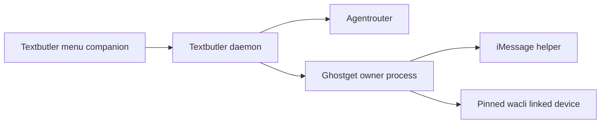

# WhatsApp through Ghostget

WhatsApp uses the same Textbutler contact settings, memory, disclosure, hooks
and reply policy as iMessage. Ghostget owns the linked device, pairing,
credentials, synchronization and send implementation. Textbutler never runs
`wacli` directly or imports a WhatsApp session database.

## Setup and behavior

Configure the WhatsApp account and its managed automation permissions in
Ghostget, install its verified private messaging helper, then select that
account in Textbutler's private `state/host.json`. Synchronization, enrollment and activation require explicit owner protocol
operations; the current menu shows status but does not initiate them. Enable a
contact only after the selected agent account passes its checks. New contacts and new installations start inactive.
See [runtime setup](../../packages/textbutler/README.md).

Version 2 enrollment preserves the canonical conversation JID, exact account
incarnation, source generation and participant identity. Phone-number and
linked-identity JIDs are never equated from similar digits. Self chats,
broadcasts, newsletters and unsupported groups cannot be enrolled.

The Ghostget provider uses a reviewed private transport patch on
[wacli](https://github.com/openclaw/wacli) 0.15.0. A single owned synchronization
process maintains a bounded SQLite event journal and accepts generation-bound
private requests. Each outward request gets a durable claim and one application
dispatch attempt. It does not reuse stock send retry behavior after a timeout.
The exact binary, patch and resource hashes are recorded in Ghostget's package.

Events preserve message identity, authored time, edits, deletion and reactions.
Cursor anchors detect retention gaps and replaced stores. Catch-up and old
history never trigger replies. A new owner message cancels pending composition
and starts the contact's cooldown. Uncertain send or process cleanup blocks
further automatic activity until reconciled.

## Actions

| Action | Implementation |
| --- | --- |
| Text and files | Recipient-bound sends with admitted bytes and durable result claims. |
| Reactions | Add/remove a supported reaction to a message in the selected conversation. |
| Stickers | Bounded admitted media through the private provider action. |
| Links and polls | Native provider operations when observed and explicitly allowed. |
| App Clips and mini-app experiences | Unavailable; no corresponding reviewed WhatsApp executor. |

Capabilities are observed per account and intersected with its managed
permissions. An unavailable capability is never converted to another action.
Textbutler adds its configured disclosure before all rich responses.

[WPPConnect](https://github.com/wppconnect-team/wppconnect) remains an alternative
Ghostget provider implementation if a specific missing capability warrants it.
It is not a second linked-device stack inside Textbutler. Replacing the provider
must preserve identity and pending-action reconciliation or require explicit
re-enrollment.

## Evidence

Synthetic adapter, SQLite journal, private transport, and process tests exercise
the implemented boundary without pairing a real account or messaging anyone.
The native patch has plain and FTS Go tests, vet checks and repeat-build evidence.
These checks establish source behavior, not live WhatsApp delivery. Real pairing,
reconnect and rich-action acceptance still require a bounded owner-authorized
test. The older `createGhostgetWhatsAppTransport()` stays a read-only compatibility
adapter; automation uses `createGhostgetAutomationTransport()` and the
[versioned owner protocol](ghostget-contract.md).
